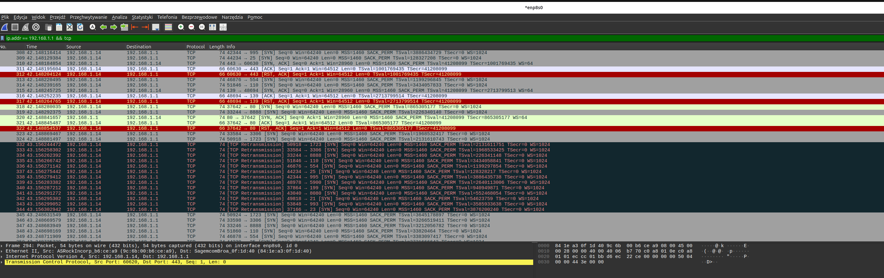

# Network Analysis: nmap Scan Captured with Wireshark

## Goal
Perform an `nmap` service scan against my home router and capture the resulting traffic with Wireshark, to understand — from a defender's perspective — what a port scan actually looks like on the wire.

## Environment
- **Scanning host:** Ubuntu (`192.168.1.14`, interface `enp8s0`)
- **Target:** Home router — Sagemcom Funbox (`192.168.1.1`)
- **Tools:** `nmap 7.98`, Wireshark

## Methodology

1. Identified the active network interface with `ip a` → `enp8s0`
2. Started a Wireshark capture on `enp8s0`
3. Ran a service-detection scan against the router:
```bash
   nmap -sV 192.168.1.1
```
4. Stopped the capture once the scan completed
5. Filtered the capture to isolate traffic between the two hosts:


ip.addr == 192.168.1.1 && tcp
## nmap Results

| Port | State | Service |
|------|-------|---------|
| 53/tcp | open | domain (DNS) |
| 80/tcp | open | http |
| 113/tcp | closed | ident |
| 135/tcp | closed | msrpc |
| 139/tcp | open | netbios-ssn (Samba) |
| 443/tcp | open | ssl/https |
| 445/tcp | open | netbios-ssn (Samba) |
| 631/tcp | open | ipp |
| *992 other ports* | filtered | no response |

Both port 80 and port 443 serve the same router login page — meaning the admin panel is reachable over plain HTTP as well as HTTPS, which is worth flagging as a minor risk (credentials could be submitted unencrypted if a user logs in via the HTTP version).

## Wireshark Findings

Two distinct traffic patterns emerged, depending on port state:

### Pattern A — Open port (e.g. 443, 139, 80)
192.168.1.14 → 192.168.1.1   [SYN]
192.168.1.1  → 192.168.1.14  [SYN, ACK]
192.168.1.14 → 192.168.1.1   [ACK]
192.168.1.14 → 192.168.1.1   [RST, ACK]

A full TCP three-way handshake completes, because `-sV` needs to actually connect to grab a service banner (e.g. HTTP response headers) to fingerprint the version. Once nmap has what it needs, **my own machine** sends the `RST, ACK` to immediately tear the connection down — the reset is scanner-initiated, not the target rejecting anything.

### Pattern B — Filtered port (e.g. 995, 25, 554, 8888, 1723...)
192.168.1.14 → 192.168.1.1   [SYN]
(no response)
192.168.1.14 → 192.168.1.1   [TCP Retransmission] [SYN]

No `SYN/ACK` and no `RST` came back at all. The router's firewall is silently dropping these packets rather than actively rejecting them. Because my machine doesn't know whether the packet was lost in transit or deliberately blocked, it retransmits the `SYN` — visible in Wireshark as repeated `[TCP Retransmission]` entries. This matches nmap's own summary: `992 filtered tcp ports (no-response)`.

### Layer 2 detail

The Ethernet II header shows the MAC addresses of both physical devices on the local network:
Src: ASRockIncorp_b6:ce:a9 (9c:6b:00:b6:ce:a9)   — my machine's NIC
Dst: SagemcomBroa_0f:1d:40 (84:1e:a3:0f:1d:40)   — the Funbox router
Wireshark resolves the OUI (first 3 bytes of the MAC) to the manufacturer, which is a useful sanity check for identifying devices on a LAN independent of IP address.

## Key Takeaways

- **Open vs. filtered ports look completely different on the wire.** An open port produces a full handshake followed by a scanner-initiated `RST`. A filtered port produces silence and retransmissions — there's no reset because the firewall never engages the SYN at the TCP layer.
- **The `RST, ACK` after a successful handshake is not a rejection.** It's the scanning host closing a connection it no longer needs, once it has already extracted the service banner.
- **Silently dropping packets (filtering) is more defensive than actively rejecting them (closed/RST).** A closed port confirms "nothing is listening here." A filtered port gives an attacker no confirmation either way, making reconnaissance slower and less reliable.
- **Serving the same login page over both HTTP and HTTPS is a minor exposure** — it leaves room for credentials to be sent unencrypted if HTTPS isn't enforced.

## Screenshot


